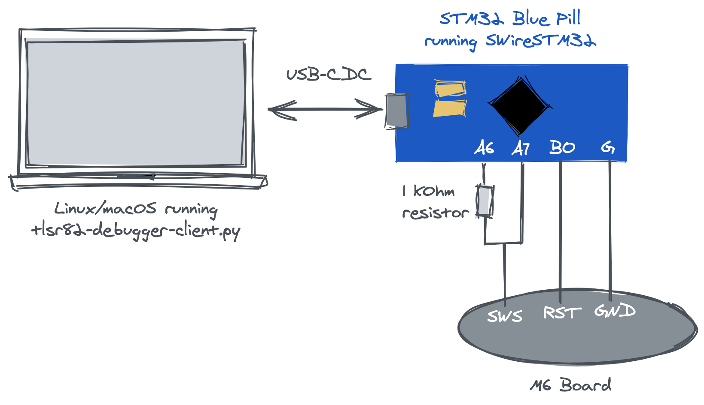

# SWire Interface

Included in this project is a Raspberry Pi Pico/W micropython project that allows SWire communication with the TSLR chips. The client is 95% rbarons code, and the micropython code is mostly my own. It uses PIO to communicate with the MCU, and the micropython Raw REPL to interface with the pico.

Depending on the crystal speed attached to your TLSR chip, you might need to fiddle with the timings. I've got 12Mhz and 16Mhz devices - and they need different timings. I've provided timings that work for me in the code.

There is no need to copy any code on to the Pi, `client.py` will copy `remote.py` to the Pi via the micropython REPL. The only requirement on the Pi side is that micropython be flashed on to the device. 

The circuit diagram matches the schematic provided by rbaron (Image from https://rbaron.net/blog/2021/07/06/Reverse-engineering-the-M6-smart-fitness-band.html), but with a Raspberry 
Pi Pico rather than an STM32. The pin mapping between STM32 and RPi Pico (as coded in `remote.py` - change if required) are as follows:

* A6 -> GP17
* A7 -> GP15
* B0 -> GP14

Typical usage for flashing the firmware looks something like

`python client.py write_flash ../../_build/lightblemesh.bin && python client.py cpu_reset`