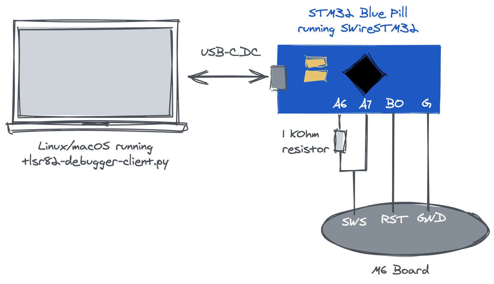

# SWire Interface

## Overview

This project includes a Raspberry Pi Pico/W MicroPython implementation for SWire communication with TLSR chips. It uses PIO to communicate with the MCU at the bit level, and the MicroPython Raw REPL to interface with the Pico from a host PC. The Python client is based on [rbaron's SWire client](https://github.com/rbaron/m6-reveng), with a custom MicroPython device implementation.

## Prerequisites

- A Raspberry Pi Pico or Pico W with [MicroPython firmware](https://micropython.org/download/RPI_PICO/) installed
- Python 3 and the dependencies from `utilities/picow_swire/requirements.txt` installed on the host

There is no need to manually copy any code to the Pico — `client.py` automatically uploads `remote.py` to the device via the MicroPython Raw REPL on each run.

## Timing Configuration

TLSR8266 devices may use either a 12 MHz or 16 MHz crystal oscillator, which affects SWire timing requirements. If communication is unreliable, the timing constants in `remote.py` may need to be adjusted to match the crystal frequency of the target device. The repository includes timing values that work for both 12 MHz and 16 MHz devices; select the appropriate set for your hardware.

## Hardware Connections

The circuit follows the schematic provided by rbaron (see [rbaron's blog post](https://rbaron.net/blog/2021/07/06/Reverse-engineering-the-M6-smart-fitness-band.html)), adapted for a Raspberry Pi Pico instead of an STM32.

### Pin Mapping

The following table shows the mapping from the original STM32-based schematic to the Raspberry Pi Pico GPIO pins (as defined in `remote.py`; adjust if needed):

| STM32 | RPi Pico |
|-------|----------|
| A6    | GP17     |
| A7    | GP15     |
| B0    | GP14     |



## Usage

Run all commands from the `utilities/picow_swire/` directory.

### Flash firmware

```bash
python client.py write_flash ../../_build/lightblemesh.bin
```

### Reset the CPU

```bash
python client.py cpu_reset
```

### Flash and reset in one step

```bash
python client.py write_flash ../../_build/lightblemesh.bin && python client.py cpu_reset
```